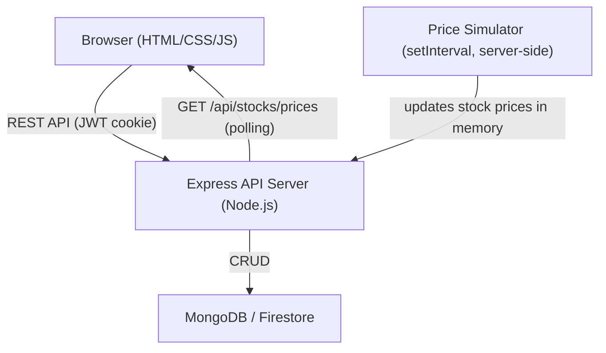

# Design Document: PaperTrade Full-Stack Upgrade

## Overview

PaperTrade is being upgraded from a single-page frontend-only app (HTML/CSS/JS + localStorage) to a full-stack web application. The existing glassmorphism UI, Chart.js integration, and mock stock data are preserved. The upgrade adds:

- A Node.js/Express REST API backend
- MongoDB (primary) or Firebase Firestore (alternative) for persistent multi-user data
- JWT-based authentication with 24-hour session tokens
- Server-side trade execution, portfolio tracking, and leaderboard
- Simulated real-time price updates via server-side polling endpoint

The frontend transitions from direct localStorage manipulation to API calls, keeping the same visual structure and UX flow.

---

## Architecture



### Key Architectural Decisions

- **Monorepo layout**: `server/` for backend, `client/` (renamed from `trade1/`) for frontend. A root `package.json` orchestrates both.
- **In-memory stock prices**: Stock prices live in server memory (seeded from `data.js` values). Updated every 3 seconds by the Price Simulator. Price history is not persisted to the database — only the rolling 50-point window in memory.
- **JWT in HttpOnly cookie**: Tokens are stored in an HttpOnly cookie (not localStorage) to prevent XSS theft. The `/api/auth/logout` endpoint clears the cookie.
- **Atomic trade execution**: Buy/sell operations use a MongoDB session (transaction) to update balance and portfolio atomically, preventing race conditions.
- **Portfolio value snapshots**: Recorded in the database on every trade execution, enabling the portfolio trend chart (Requirement 16).

---

## Components and Interfaces

### Backend Components

#### `AuthController` (`server/controllers/auth.js`)
Handles registration, login, and logout.

| Endpoint | Method | Auth | Description |
|---|---|---|---|
| `/api/auth/register` | POST | None | Create user, return JWT cookie |
| `/api/auth/login` | POST | None | Validate credentials, return JWT cookie |
| `/api/auth/logout` | POST | JWT | Clear JWT cookie |

#### `TradeController` (`server/controllers/trade.js`)
Handles buy/sell order execution.

| Endpoint | Method | Auth | Description |
|---|---|---|---|
| `/api/trade` | POST | JWT | Execute buy or sell order atomically |

#### `UserController` (`server/controllers/user.js`)
Handles portfolio, history, and account reset.

| Endpoint | Method | Auth | Description |
|---|---|---|---|
| `/api/user/portfolio` | GET | JWT | Return portfolio with current prices applied |
| `/api/user/history` | GET | JWT | Return transaction history (most recent first) |
| `/api/user/reset` | POST | JWT | Reset balance, portfolio, history, snapshots |

#### `LeaderboardController` (`server/controllers/leaderboard.js`)

| Endpoint | Method | Auth | Description |
|---|---|---|---|
| `/api/leaderboard` | GET | JWT | Return top 10 users by total portfolio value |

#### `StockController` (`server/controllers/stock.js`)

| Endpoint | Method | Auth | Description |
|---|---|---|---|
| `/api/stocks/prices` | GET | None | Return current in-memory prices for all stocks |

#### `PriceSimulator` (`server/services/priceSimulator.js`)
Runs a `setInterval` every 3 seconds on the server. Updates each stock's price by a random ±2% change, enforces a $1.00 floor, and maintains a rolling 50-point history array in memory.

#### `authMiddleware` (`server/middleware/auth.js`)
Verifies the JWT from the HttpOnly cookie on every protected route. Returns 401 if missing or invalid.

### Frontend Components (refactored from existing `trade1/`)

The existing monolithic `app.js` is split into focused modules:

- **`api.js`** — thin `fetch` wrapper for all API calls; handles 401 redirects automatically
- **`auth.js`** — login/signup/logout UI logic
- **`trade.js`** — trade form, stock search, price chart rendering
- **`portfolio.js`** — portfolio table, doughnut chart, trend chart
- **`history.js`** — transaction history table
- **`leaderboard.js`** — leaderboard rendering
- **`theme.js`** — dark/light mode toggle (localStorage, unchanged from existing)
- **`notifications.js`** — toast notification system (unchanged logic)
- **`pricePoller.js`** — polls `/api/stocks/prices` every 3 seconds, updates displayed prices and charts

---

## Data Models

### User (MongoDB collection: `users`)

```js
{
  _id: ObjectId,
  username: String,          // unique, indexed
  passwordHash: String,      // bcrypt hash
  balance: Number,           // default: 10000
  portfolio: [
    {
      symbol: String,        // e.g. "AAPL"
      quantity: Number,      // shares held
      avgPrice: Number       // weighted average purchase price
    }
  ],
  portfolioSnapshots: [
    {
      value: Number,         // total portfolio value at snapshot time
      timestamp: Date
    }
  ],                         // capped at 30 entries (oldest dropped)
  createdAt: Date
}
```

### Transaction (MongoDB collection: `transactions`)

```js
{
  _id: ObjectId,
  userId: ObjectId,          // ref: users._id, indexed
  action: String,            // "BUY" | "SELL"
  symbol: String,
  quantity: Number,
  price: Number,             // price per share at execution time
  total: Number,             // price × quantity
  timestamp: Date            // indexed for sort
}
```

### In-Memory Stock (server-side only, not persisted to DB)

```js
{
  symbol: String,
  name: String,
  price: Number,
  history: Number[],         // rolling 50-point price history
}
```

### JWT Payload

```js
{
  sub: String,               // user._id as string
  username: String,
  iat: Number,
  exp: Number                // iat + 86400 (24h)
}
```

---

## Correctness Properties

*A property is a characteristic or behavior that should hold true across all valid executions of a system — essentially, a formal statement about what the system should do. Properties serve as the bridge between human-readable specifications and machine-verifiable correctness guarantees.*

**Property Reflection Notes:**
- Requirements 5.1 and 5.2 (buy/sell balance conservation) are distinct directions of the same invariant and are kept separate.
- Requirements 5.3, 5.4, and 5.5 (rejection cases) are consolidated into a single "trade rejection preserves state" property since they all share the same postcondition: state is unchanged.
- Requirements 6.2 and 6.3 (P/L dollar and P/L percentage) are combined into one P/L calculation property.
- Requirements 6.4 and 6.5 (green/red P/L display) are combined into one color coding property.
- Requirements 8.2 and 8.3 (price floor and rolling window) are kept separate as they test different invariants.
- Requirements 10.1 and 10.2 (leaderboard ordering and field completeness) are kept separate.
- Requirements 15.5 (atomic trade) and 15.9 (401 on invalid token) are kept as they test distinct security/correctness properties.

---

### Property 1: New account starting capital

*For any* valid registration with a unique username and password of at least 6 characters, the created user account SHALL have a Virtual_Balance of exactly $10,000.

**Validates: Requirements 1.1**

---

### Property 2: Short password rejection

*For any* password string of length 0 through 5 (inclusive), the registration endpoint SHALL reject the request and no user account SHALL be created.

**Validates: Requirements 1.3**

---

### Property 3: Invalid credential error message consistency

*For any* login attempt with credentials that do not match a registered user, the Auth_Service SHALL always return the message "Invalid username or password" — never a message that reveals whether the username or password was the incorrect field.

**Validates: Requirements 2.2**

---

### Property 4: Invalid token rejection on protected endpoints

*For any* HTTP request to a protected endpoint carrying a missing, malformed, or expired JWT, the API SHALL return HTTP 401 Unauthorized and the requested operation SHALL NOT be performed.

**Validates: Requirements 2.5, 15.9**

---

### Property 5: Currency formatting

*For any* non-negative numeric balance value, the formatCurrency function SHALL produce a string matching the pattern `$N,NNN.NN` (USD format with two decimal places and comma thousands separators).

**Validates: Requirements 3.1**

---

### Property 6: Stock search result relevance and count

*For any* non-empty search query string Q and any stock dataset, every result returned by the search function SHALL contain Q (case-insensitive) in either the stock symbol or the stock name, and the total number of results SHALL not exceed 5.

**Validates: Requirements 4.1**

---

### Property 7: Buy order balance conservation

*For any* user with balance B and a valid buy order of quantity Q at price P (where B ≥ Q × P and Q > 0), after the trade executes the user's balance SHALL equal B − (Q × P) and the portfolio holding for that stock SHALL increase by exactly Q.

**Validates: Requirements 5.1**

---

### Property 8: Sell order balance conservation

*For any* user holding at least Q shares of a stock at price P (where Q > 0), after a sell order of quantity Q executes the user's balance SHALL increase by exactly Q × P and the portfolio holding SHALL decrease by exactly Q.

**Validates: Requirements 5.2**

---

### Property 9: Invalid trade rejection preserves state

*For any* trade order that is invalid (buy cost exceeds balance, sell quantity exceeds holdings, or quantity ≤ 0), the Trade_Engine SHALL reject the order and the user's balance and portfolio SHALL remain byte-for-byte identical to their pre-request state.

**Validates: Requirements 5.3, 5.4, 5.5**

---

### Property 10: Transaction recorded on successful trade

*For any* successfully executed trade, a Transaction record SHALL be created containing the correct action, symbol, quantity, price, total (price × quantity), and a timestamp within the current second.

**Validates: Requirements 5.6**

---

### Property 11: Zero-holding removal

*For any* sell order that reduces a portfolio holding to exactly 0 shares, the Portfolio_Service SHALL remove that stock's entry from the portfolio entirely (no zero-quantity entries remain).

**Validates: Requirements 5.7**

---

### Property 12: P/L calculation correctness

*For any* portfolio holding with average purchase price A (A > 0), current price C, and quantity Q, the computed P/L SHALL equal (C − A) × Q and the P/L percentage SHALL equal ((C − A) / A) × 100.

**Validates: Requirements 6.2, 6.3**

---

### Property 13: P/L color coding

*For any* P/L value that is strictly positive, the rendered display class SHALL indicate green (positive). *For any* P/L value that is strictly negative, the rendered display class SHALL indicate red (negative).

**Validates: Requirements 6.4, 6.5**

---

### Property 14: Total portfolio value calculation

*For any* portfolio with N holdings, the displayed total portfolio value SHALL equal the sum of (quantity_i × currentPrice_i) for all i from 1 to N.

**Validates: Requirements 6.6**

---

### Property 15: Transaction history ordering

*For any* user with multiple transactions, the history returned by the API SHALL be ordered by timestamp descending — every transaction at index i SHALL have a timestamp greater than or equal to the transaction at index i+1.

**Validates: Requirements 7.1**

---

### Property 16: Transaction history field completeness

*For any* transaction record, the API response SHALL include all of: action (BUY/SELL), symbol, quantity, price per share, total value, and timestamp.

**Validates: Requirements 7.2**

---

### Property 17: Transaction history page limit

*For any* user with more than 50 transactions, the history endpoint SHALL return at most 50 transactions per response.

**Validates: Requirements 7.3**

---

### Property 18: Price simulator change range

*For any* price update tick, the absolute percentage change applied to each stock price SHALL be in the range [0%, 2%], meaning the new price SHALL be in the range [price × 0.98, price × 1.02].

**Validates: Requirements 8.1**

---

### Property 19: Price floor enforcement

*For any* stock price update, regardless of the random change applied, the resulting price SHALL be greater than or equal to $1.00.

**Validates: Requirements 8.2**

---

### Property 20: Price history rolling window

*For any* stock that has received more than 50 price updates, the price history array length SHALL equal exactly 50 (oldest entries are dropped).

**Validates: Requirements 8.3**

---

### Property 21: Leaderboard ordering

*For any* set of users with different total portfolio values, the leaderboard SHALL list them in descending order of total portfolio value — every entry at rank R SHALL have a total portfolio value greater than or equal to the entry at rank R+1.

**Validates: Requirements 10.1**

---

### Property 22: Leaderboard entry field completeness

*For any* leaderboard entry, the response SHALL include all of: rank number, username, and total portfolio value.

**Validates: Requirements 10.2**

---

### Property 23: Theme toggle round-trip

*For any* initial theme state (dark or light), toggling the theme twice SHALL return the application to the original theme state.

**Validates: Requirements 11.1**

---

### Property 24: Theme persistence round-trip

*For any* theme selection, after the theme is saved to localStorage and the page is reloaded (simulated by reading from localStorage), the applied theme SHALL match the saved theme.

**Validates: Requirements 11.2**

---

### Property 25: Theme icon correctness

*For any* theme state, when Light_Mode is active the toggle button SHALL display the moon icon (🌙), and when Dark_Mode is active it SHALL display the sun icon (☀️).

**Validates: Requirements 11.4**

---

### Property 26: Account reset completeness

*For any* user account state (any balance, any portfolio contents, any transaction history), after a confirmed reset the user's balance SHALL equal exactly $10,000, the portfolio SHALL be empty, and the transaction history SHALL be empty.

**Validates: Requirements 12.1**

---

### Property 27: Success notification content

*For any* successfully executed trade with action A, quantity Q, and symbol S, the displayed success notification SHALL contain A, Q, and S in its text.

**Validates: Requirements 13.1**

---

### Property 28: Portfolio snapshot on trade

*For any* trade execution, a portfolio value snapshot SHALL be recorded, and the snapshot value SHALL equal the user's post-trade balance plus the sum of all holdings valued at current prices at the time of the trade.

**Validates: Requirements 16.2**

---

## Error Handling

### Authentication Errors

| Scenario | HTTP Status | Response Body |
|---|---|---|
| Username already taken | 409 | `{ "error": "Username already taken" }` |
| Password < 6 chars | 400 | `{ "error": "Password must be at least 6 characters" }` |
| Invalid credentials | 401 | `{ "error": "Invalid username or password" }` |
| Missing/expired JWT | 401 | `{ "error": "Unauthorized" }` |

### Trade Errors

| Scenario | HTTP Status | Response Body |
|---|---|---|
| Insufficient balance | 400 | `{ "error": "Insufficient balance" }` |
| Insufficient shares | 400 | `{ "error": "Insufficient shares" }` |
| Quantity ≤ 0 | 400 | `{ "error": "Quantity must be greater than zero" }` |
| Unknown stock symbol | 400 | `{ "error": "Unknown stock symbol" }` |

### General Errors

- All unhandled exceptions return `500` with `{ "error": "Internal server error" }` — stack traces are never exposed to the client.
- Input validation is performed with `express-validator` before reaching controller logic.
- MongoDB connection failures are caught at startup; the server exits with a non-zero code so a process manager (e.g., PM2) can restart it.

### Frontend Error Handling

- All `fetch` calls check `response.ok`; on failure, the error message from the response body is passed to `showNotification()`.
- A 401 response from any API call triggers an automatic redirect to the login page.
- Network errors (no connection) display a generic "Network error, please try again" notification.

---

## Testing Strategy

### Unit Tests (Jest)

Focus on pure logic that can be tested in isolation:

- `priceSimulator.js` — price update logic, floor enforcement, history window capping
- Trade validation logic — balance check, shares check, quantity validation
- P/L calculation functions
- JWT generation and verification helpers
- Password hashing and comparison helpers
- `formatCurrency` utility function

Avoid writing too many unit tests for things covered by property tests. Unit tests should focus on specific examples, integration points, and edge cases not covered by property generators.

### Property-Based Tests (fast-check, minimum 100 iterations each)

Each property test is tagged with a comment referencing its design property:
`// Feature: paper-trading-app, Property N: <property text>`

- **Property 1**: Generate random valid (username, password ≥ 6 chars) pairs; verify created account balance === 10000.
- **Property 2**: Generate passwords of length 0–5; verify all registrations are rejected.
- **Property 3**: Generate random (username, password) pairs not matching any user; verify error message is always the generic one.
- **Property 4**: Generate random invalid JWT strings; send to all protected endpoints; verify all return 401.
- **Property 5**: Generate random non-negative numbers; verify `formatCurrency` output matches USD pattern.
- **Property 6**: Generate random query strings and stock datasets; verify all results match query (case-insensitive) and count ≤ 5.
- **Properties 7 & 8**: Generate random (balance, price, quantity) tuples for valid buy/sell; verify exact balance conservation.
- **Property 9**: Generate invalid orders (over-budget, over-shares, zero/negative qty); verify rejection and state immutability.
- **Property 10**: Execute random valid trades; verify transaction record created with correct fields.
- **Property 11**: Generate random portfolios; execute full-sell; verify zero-quantity entries removed.
- **Property 12**: Generate random (avgPrice, currentPrice, quantity) tuples; verify P/L formula output.
- **Property 13**: Generate random positive and negative P/L values; verify correct CSS class applied.
- **Property 14**: Generate random portfolios with prices; verify total equals sum of individual values.
- **Property 15**: Generate random transaction sets with varying timestamps; verify descending sort order.
- **Property 16**: Generate random transactions; verify all required fields present.
- **Property 17**: Create users with >50 transactions; verify response length ≤ 50.
- **Properties 18 & 19**: Run price simulator ticks; verify change within ±2% and price ≥ $1.00.
- **Property 20**: Apply N > 50 updates to a stock; verify history.length === 50.
- **Properties 21 & 22**: Generate random user portfolio values; verify leaderboard sorted descending with all required fields.
- **Properties 23–25**: Test theme toggle round-trip, localStorage persistence, and icon correctness.
- **Property 26**: Generate random user states; execute reset; verify balance=10000, portfolio=[], history=[].
- **Property 27**: Execute random valid trades; verify notification text contains action, quantity, symbol.
- **Property 28**: Execute random trades; verify snapshot recorded with correct value formula.

### Integration Tests (Supertest + MongoDB Memory Server)

Test the full HTTP request/response cycle against an in-memory MongoDB instance:

- Auth flow: register → login → access protected route → logout → access protected route (expect 401)
- Trade flow: register → login → buy → check portfolio → sell → check balance
- Reset flow: register → login → trade → reset → verify clean state
- Leaderboard: multiple users with different portfolios → verify ranking order
- History pagination: user with 60 transactions → verify only 50 returned

### Smoke / Manual Tests

- Dark/light mode toggle persists across page reload (no flash of unstyled content)
- Mobile layout at 375px viewport (no horizontal scroll, touch targets ≥ 44×44px)
- Notification stacking (trigger 3 trades rapidly, verify all visible without overlap)
- Chart updates in place after price tick (no chart destroy/recreate for same stock)
- Price dropdown updates within 3 seconds of simulator tick
